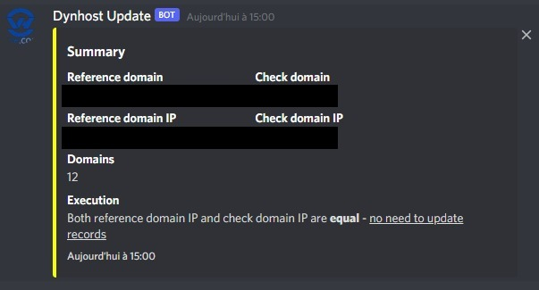
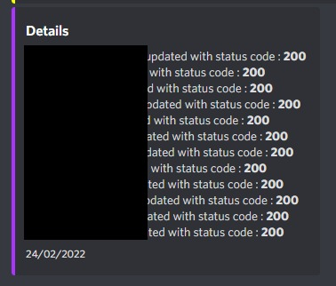

# Python-DynHost-Automation
OVH dynamic DNS automation in Python. For *bash* script, check [this repository](https://github.com/Gyrfalc0n/DynHost-Automation)

## What is it ?

This is a simple script that allows you to check DNS entries for a list of subdomains and replace the record if the public IP of the network in which the script is run differs from that of the record. In short, play the role of a dynamic DNS updater. Assigned to a scheduled task exploits the full power of the script. Discord notification via webhook are implemented. Original script from [this Github repo](https://github.com/yjajkiew/dynhost-ovh).

## Installation

First, you need to clone the repo, then, install pip package `discord_webhook`. To get it, run this command : 

```bash
pip install discord_webhook
```

Now, you can execute it.

## Configuration

Some configuration is needed to make it work.

### Adding the two reference domain 

The script check the IPv4 address of the given `reference domain`, and compare it to the given `domain`. If IP's are different, all registered domains in `host` list will be updated with IPv4 value of `reference_domain`.

Modify the following lines to match your domains :

```py
domain = 'subdomain.domain.com' # Reference domain for local / public IP check
reference_domain = 'subdomain.domain.com' # local domain to check
```

### Adding domains

You have to modify **subdomain.domain.com**, **username** and **password** to match your subdomain address, your __DynHost id__ and the __password__ assigned to it. 

```bash
['subdomain.domain.com','username','password'],
```


You can add as much domains as you want, just duplicate the line above and modify the values to match your DynHost domain entry. Host are in a list.


## Execution

```bash
python3 dynhost.py
```

## Scheduled task

The interest of this script is to be executed periodically. The best way to do this is to create a scheduled task with CRON, or any other task scheduler of your choice.

## Discord notification

Dont forget to add your *webhook* url. [Help to find it is given here](https://support.discord.com/hc/en-us/articles/228383668-Intro-to-Webhooks)

Then, you need to specify your Discord ID, to be mentionned every time records are updated. [Help to find it is given here](https://support.discord.com/hc/en-us/articles/206346498-Where-can-I-find-my-User-Server-Message-ID-)
Modify the following line (replace `my_id` with your Discord user ID) : 

```py
discord_username = '<@my_id>'
```

### Basic notification, no modification of DNS



### Detailed notification, DNS entries have been modified


